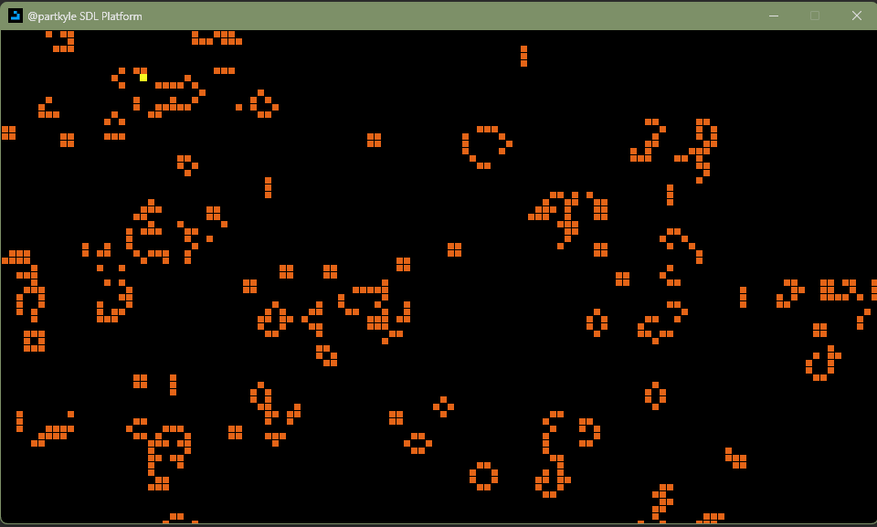

Game Of Life
============

An SDL implementation of Conway's game of life

Controls
========

- ESC: Pause generation calculation

- WASD: Movement

- Up: speed up generation calculation
- Down: slow down generation calculation
- Left: set to minimum speed
- Right: set to maximum speed

- Space: cycle through preselected shapes

- Mouse Wheel + Drag: Movement
- Mouse Scroll: Zoom In/Out
- Click: Make cell(s) under cursor alive
